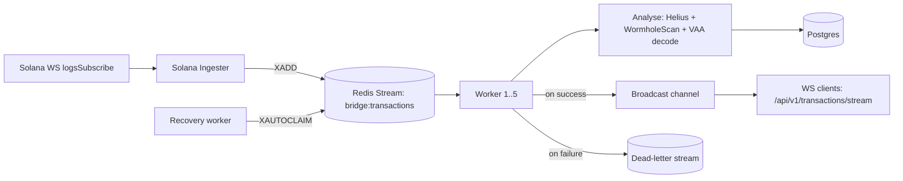

# bridgeIndexer

A real-time indexer for Wormhole cross-chain bridge transfers — watches
each chain's Token Bridge contract, correlates every transfer against its
destination-chain completion, persists it, and streams it live to clients
over WebSocket. Currently indexes Solana, with additional chains landing
incrementally.

## Architecture



Every successfully analysed transaction is persisted to Postgres and, in the
same step, broadcast to any connected WebSocket clients — so the live feed and
the durable record come from a single source of truth, not two separate paths
that can drift.

### Why Redis Streams, not Kafka

Consumer groups plus `XAUTOCLAIM` give exactly the guarantees this needs —
at-least-once delivery, per-worker ack tracking, automatic redelivery of
stuck messages — without a second infrastructure dependency to operate.
Kafka would be the right call at higher throughput or with multiple
independent consumer applications; for a single-service pipeline at this
scale it's added operational cost for guarantees Redis Streams already
provides.

## Reliability properties

* **At-least-once processing, exactly-once persistence.** Redis Streams
  guarantees at-least-once delivery; Postgres upserts on `hash` and
  `(emitter_chain, emitter_address, sequence)` absorb redelivery, so a crash
  mid-batch can never double-write.
* **Dead-letter queue.** Transactions that fail analysis or persistence after
  retries move to `bridge:transactions:failed` instead of blocking the stream
  or being silently dropped.
* **Self-healing recovery.** A dedicated worker reclaims messages abandoned by
  a crashed consumer via `XAUTOCLAIM` every 30s.
* **Graceful shutdown.** SIGTERM/Ctrl+C stops new work being picked up, lets
  in-flight messages finish, and drains open HTTP/WS connections before exit.

## API

GET /api/v1/transactions/analyse?transaction\_hash=<hash>
WS /api/v1/transactions/stream

CORS is origin-allowlisted via `ALLOWED_ORIGINS` — nothing is permitted by
default.

## Running locally

Requires Postgres and Redis reachable at the URLs below.

```bash
cp .env.example .env   # fill in RPC URLs, bridge contract addresses, etc.
sqlx migrate run
cargo run
```

## Testing

```bash
cargo test
```

`tests/persistence_idempotency.rs` spins up a real Postgres container
(via `testcontainers`) and asserts that redelivering the same transaction —
the scenario `XAUTOCLAIM` recovery guarantees will happen — never produces a
duplicate row.

## Roadmap: multi-chain ingestion

Ingestion currently watches Solana only — transfers are correctly attributed
to their real source/destination chain in either direction (Solana → X or
X → Solana), but a transfer that never touches Solana isn't observed yet.

The correlation layer (`services::correlator`) and the destination-lookup
adapters (`chain_adapters::evm`, `chain_adapters::wormholescan`) are already
chain-agnostic — they were built against `AdapterRegistry`, keyed by Wormhole
chain ID, specifically so adding a chain doesn't require touching correlation
logic. What's missing per chain is the ingestion side: a chain-specific
listener that watches its Token Bridge contract and pushes candidates onto
the same `bridge:transactions` Redis stream Solana's ingester already writes
to.

Planned rollout, one chain at a time:

* \[x] Solana
* \[ ] Ethereum
* \[ ] BSC
* \[ ] additional EVM chains, as the pattern proves out

Each addition is a new `ingestion::<chain>` module plus a normaliser for that
chain's transaction shape — the Redis pipeline, correlator, persistence, and
WebSocket fanout all stay untouched.
