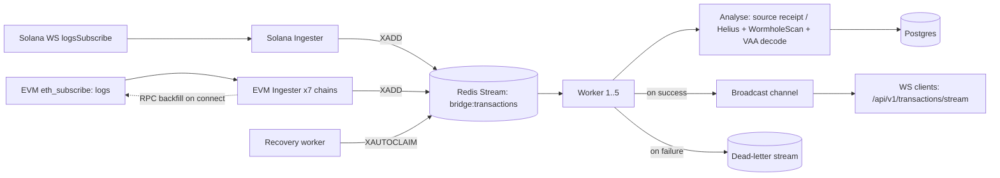

# bridgeIndexer

A real-time indexer for Wormhole cross-chain bridge transfers — watches
each chain's Token Bridge / Core Bridge contract, correlates every transfer
against its destination-chain completion, persists it, and streams it live
to clients over WebSocket. Indexes Solana and seven EVM chains (Ethereum,
BSC, Polygon, Avalanche, Arbitrum, Optimism, Base) natively via RPC —
Gnosis is supported as a destination chain only (its Core Bridge never
originates transfers, so there's nothing to ingest there).

## Architecture



Every successfully analysed transaction is persisted to Postgres and, in the
same step, broadcast to any connected WebSocket clients — so the live feed and
the durable record come from a single source of truth, not two separate paths
that can drift.

Each EVM ingester subscribes to its chain's Core Bridge `LogMessagePublished`
event over a WebSocket (`eth_subscribe`), and on (re)connect runs an
`eth_getLogs` backfill from the last checkpointed block to catch anything
missed while disconnected. EVM transfers are decoded straight from the
source transaction's own receipt (see "Why no more WormholeScan for EVM"
below) — Solana still resolves via WormholeScan/VAA for now.

### Why Redis Streams, not Kafka

Consumer groups plus `XAUTOCLAIM` give exactly the guarantees this needs —
at-least-once delivery, per-worker ack tracking, automatic redelivery of
stuck messages — without a second infrastructure dependency to operate.
Kafka would be the right call at higher throughput or with multiple
independent consumer applications; for a single-service pipeline at this
scale it's added operational cost for guarantees Redis Streams already
provides.

### Why no more WormholeScan for EVM

For EVM chains, a transfer's Wormhole message (`LogMessagePublished`) is
emitted by the Core Bridge in the *same transaction* as the token transfer —
so the source-side receipt already contains everything WormholeScan would
otherwise be asked for. `chain_adapters::evm` and `clients::evm` decode it
directly, removing a network hop and an external dependency for source-chain
analysis. Solana's token bridge program doesn't expose the same guarantee in
a way that's been verified against the on-chain IDL yet, so it keeps going
through WormholeScan for now (see the note in `services::analyzer`).

## Reliability properties

* **At-least-once processing, exactly-once persistence.** Redis Streams
  guarantees at-least-once delivery; Postgres upserts on `hash` and
  `(emitter_chain, emitter_address, sequence)` absorb redelivery, so a crash
  mid-batch can never double-write.
* **Dead-letter queue.** Transactions that fail analysis or persistence after
  retries move to `bridge:transactions:failed` instead of blocking the stream
  or being silently dropped.
* **Self-healing recovery.** A dedicated worker reclaims messages abandoned by
  a crashed consumer via `XAUTOCLAIM` every 30s.
* **Graceful shutdown.** SIGTERM/Ctrl+C stops new work being picked up, lets
  in-flight messages finish, and drains open HTTP/WS connections before exit.
* **`eth_getLogs` range resilience.** Both destination-chain lookups
  (`chain_adapters::evm`) and EVM ingestion backfill (`ingestion::evm`) page
  through `eth_getLogs` in provider-configurable block-size chunks rather
  than one unbounded query — the default is 2000 blocks, but any chain can be
  constructed with a tighter cap (Base is pinned to 10 blocks/call, matching
  Alchemy's free-tier limit). If a provider rejects a range as too wide at
  runtime, the adapter automatically shrinks the window and retries rather
  than failing outright.
* **Rate limiting (429) is detected, not yet retried.** A `429` from an RPC
  provider is surfaced as `UPSTREAM_RATE_LIMITED` rather than being silently
  swallowed — but nothing currently backs off and retries it automatically.
  It's a different failure mode from "range too wide" above (that's a
  request-*shape* problem the shrink logic fixes; rate limiting is a
  request-*frequency* problem shrinking doesn't fix, since a shorter range
  just means more requests). In practice this mostly shows up on `/analyse`
  for chains on constrained free-tier RPC plans, and is passed straight back
  to the caller as a `502`; retrying the request after a short delay is the
  current mitigation. See "Known gaps" below.

## API

`GET /api/v1/transactions/analyse?transaction_hash=<hash>&chain=<chain>`
`WS /api/v1/transactions/stream`

`chain` defaults to `solana` if omitted. Supported values: `solana`,
`ethereum`, `bsc`, `polygon`, `avalanche`, `arbitrum`, `optimism`, `base`.
(`gnosis` is not a valid value here — see "Known gaps".)

CORS is origin-allowlisted via `ALLOWED_ORIGINS` — nothing is permitted by
default.

## Running locally

Requires Postgres and Redis reachable at the URLs below.

```bash
cp .env.example .env   # fill in RPC/WS URLs, bridge contract addresses, etc.
sqlx migrate run
cargo run
```

Each EVM chain needs an RPC URL, a WS URL (for `eth_subscribe`), its Token
Bridge contract (destination lookups) and its Core Bridge contract
(ingestion) — see `src/config.rs` for the full list of env vars per chain.

## Testing

```bash
cargo test
```

`tests/persistence_idempotency.rs` spins up a real Postgres container
(via `testcontainers`) and asserts that redelivering the same transaction —
the scenario `XAUTOCLAIM` recovery guarantees will happen — never produces a
duplicate row.

## Known gaps

* **Gnosis is destination-only.** It's registered for destination lookups
  and token metadata, but intentionally excluded from ingestion (its Core
  Bridge never originates `LogMessagePublished`) and isn't wired into
  `core_bridge_contract_for_chain` — passing `chain=gnosis` to `/analyse`
  will currently error rather than analyse a Gnosis-source transaction.
* **No retry/backoff for `429`s.** As noted above, rate limiting is detected
  but not retried anywhere in the RPC call paths. Chains on constrained
  free-tier RPC plans (e.g. Base) are the most likely to hit this under load.
* **Solana ingestion is the only path still on WormholeScan** for pulling the
  transfer payload — see "Why no more WormholeScan for EVM."

## Roadmap

* \[x] Solana (ingestion via WormholeScan/VAA)
* \[x] Ethereum, BSC, Polygon, Avalanche, Arbitrum, Optimism, Base (native
  RPC ingestion + source-receipt analysis)
* \[ ] Retry/backoff for upstream rate limiting
* \[ ] Additional chains (e.g. NEAR — config plumbing exists, ingestion
  doesn't yet) as the pattern proves out

Each addition is a new `ingestion::<chain>` module plus a normaliser for that
chain's transaction shape — the Redis pipeline, correlator, persistence, and
WebSocket fanout all stay untouched.
