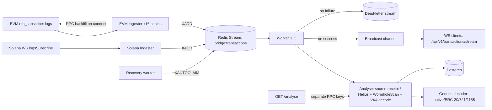

# bridgeIndexer

A real-time indexer for Wormhole cross-chain bridge transfers — watches
each chain's Token Bridge / Core Bridge contract, correlates every transfer
against its destination-chain completion, persists it, and streams it live
to clients over WebSocket. Indexes Solana and 16 EVM chains natively via RPC
(Ethereum, BSC, Polygon, Avalanche, Arbitrum, Optimism, Base, Moonbeam, Celo,
Kaia, Scroll, Linea, Berachain, Sei EVM, Unichain, Ink). Gnosis and Sonic are
supported as destination chains only — see "Known gaps" for why neither can
be a transfer's source.

## Architecture


```mermaid
flowchart LR
    SOL[Solana WS logsSubscribe] --> ING[Solana Ingester]
    EVM[EVM eth_subscribe: logs] --> ING2[EVM Ingester x16 chains]
    ING2 -.->|RPC backfill on connect| EVM
    ING -->|XADD| STREAM[(Redis Stream: bridge:transactions)]
    ING2 -->|XADD| STREAM
    STREAM --> W1[Worker 1..5]
    W1 --> ANALYSE[Analyse: source receipt / Helius + WormholeScan + VAA decode]
    ANALYSE --> DECODE[Generic decoder: native/ERC-20/721/1155]
    ANALYSE --> DB[(Postgres)]
    W1 -->|on success| BCAST[Broadcast channel]
    BCAST --> WS[WS clients: /api/v1/transactions/stream]
    W1 -->|on failure| DLQ[(Dead-letter stream)]
    RECOVERY[Recovery worker] -->|XAUTOCLAIM| STREAM
    HTTP[GET /analyse] -.->|separate RPC keys| ANALYSE
```

Every successfully analysed transaction is persisted to Postgres and, in the
same step, broadcast to any connected WebSocket clients — so the live feed and
the durable record come from a single source of truth, not two separate paths
that can drift.

Each EVM ingester subscribes to its chain's Core Bridge `LogMessagePublished`
event over a WebSocket (`eth_subscribe`), and on (re)connect runs an
`eth_getLogs` backfill from the last checkpointed block to catch anything
missed while disconnected. EVM transfers are decoded straight from the
source transaction's own receipt (see "Why no more WormholeScan for EVM"
below) — Solana still resolves via WormholeScan/VAA for now.

### Generic EVM transaction decoding

Separately from the Wormhole-specific parsing, every EVM transaction that
goes through `/analyse` is also run through `decoding::evm_decode` — a
chain-agnostic decoder (built on Alloy) that has no per-chain branches at
all. It reads the same `{ transaction, receipt }` JSON and extracts:

* native value transfers (non-zero `value` on the transaction itself)
* standard ERC-20/721 `Transfer` and `Approval` logs
* ERC-1155 `TransferSingle`/`TransferBatch` logs
* arbitrary contract calls, *if* an ABI is supplied — nothing recognises
  calldata structurally the way it does for the standard log topics above

Nothing here can fail the whole request: anything it doesn't recognise —
an unfamiliar log topic, calldata with no matching ABI — comes back as
`DecodedAction::Unknown` rather than an error, so `decoded_actions` is
always present on `NormalisedTransaction`, bridge transfer or not.

There's no ABI source wired up yet (both call sites currently pass
`abi: None`), so today every contract call decodes to `Unknown` — only the
native-transfer and standard-log paths are live. See "Known gaps."

### Ingestion vs. on-demand: separate RPC keys, separate registries

There are two independent paths through the analysis logic now, each with
its own `AdapterRegistry` and its own RPC key per chain:

* **`analyse_tx`** — called by the Redis stream consumer for transactions
  picked up by live ingestion. Uses each chain's primary RPC key
  (`<CHAIN>_RPC_URL`) and the primary registry (`AppState::registry`).
* **`analyse_tx_ondemand`** — called by the public `GET /analyse` endpoint.
  Uses each chain's optional `<CHAIN>_ONDEMAND_RPC_URL` if set (falling back
  to the primary key otherwise) and a separate registry
  (`AppState::ondemand_registry`).

The point is isolation: a burst of foreground `/analyse` calls against a
chain can't compete with that same chain's live ingestion for the same
provider's rate limit, and vice versa — *if* you've actually configured a
distinct key for that chain. Where only one key is configured, both paths
still share it and can still contend, same as before this split existed.

### Why Redis Streams, not Kafka

Consumer groups plus `XAUTOCLAIM` give exactly the guarantees this needs —
at-least-once delivery, per-worker ack tracking, automatic redelivery of
stuck messages — without a second infrastructure dependency to operate.
Kafka would be the right call at higher throughput or with multiple
independent consumer applications; for a single-service pipeline at this
scale it's added operational cost for guarantees Redis Streams already
provides.

### Why no more WormholeScan for EVM

For EVM chains, a transfer's Wormhole message (`LogMessagePublished`) is
emitted by the Core Bridge in the *same transaction* as the token transfer —
so the source-side receipt already contains everything WormholeScan would
otherwise be asked for. `chain_adapters::evm` and `clients::evm` decode it
directly, removing a network hop and an external dependency for source-chain
analysis. Solana's token bridge program doesn't expose the same guarantee in
a way that's been verified against the on-chain IDL yet, so it keeps going
through WormholeScan for now (see the note in `services::analyzer`).

## Reliability properties

* **At-least-once processing, exactly-once persistence.** Redis Streams
  guarantees at-least-once delivery; Postgres upserts on `hash` and
  `(emitter_chain, emitter_address, sequence)` absorb redelivery, so a crash
  mid-batch can never double-write.
* **Dead-letter queue.** Transactions that fail analysis or persistence after
  retries move to `bridge:transactions:failed` instead of blocking the stream
  or being silently dropped.
* **Self-healing recovery.** A dedicated worker reclaims messages abandoned by
  a crashed consumer via `XAUTOCLAIM` every 30s.
* **Graceful shutdown.** SIGTERM/Ctrl+C stops new work being picked up, lets
  in-flight messages finish, and drains open HTTP/WS connections before exit.
* **`eth_getLogs` range resilience.** Both destination-chain lookups
  (`chain_adapters::evm`) and EVM ingestion backfill (`ingestion::evm`) page
  through `eth_getLogs` in provider-configurable block-size chunks rather
  than one unbounded query — the default is 2000 blocks, but any chain can be
  constructed with a tighter cap (Base is pinned to 10 blocks/call, matching
  Alchemy's free-tier limit, in both the primary and on-demand registries).
  If a provider rejects a range as too wide at runtime, the adapter
  automatically shrinks the window and retries rather than failing outright.
* **Ingestion/on-demand RPC key separation** limits *contention* between
  background and foreground traffic per chain (see above) — it does not add
  retry or backoff for genuine provider throttling.
* **Rate limiting (429) is detected, not yet retried.** A `429` from an RPC
  provider is surfaced as `UPSTREAM_RATE_LIMITED` rather than being silently
  swallowed — but nothing currently backs off and retries it automatically.
  It's a different failure mode from "range too wide" above (that's a
  request-*shape* problem the shrink logic fixes; rate limiting is a
  request-*frequency* problem shrinking doesn't fix, since a shorter range
  just means more requests). Retrying the request after a short delay is the
  current mitigation. See "Known gaps" below.

## API

`GET /api/v1/transactions/analyse?transaction_hash=<hash>&chain=<chain>`
`WS /api/v1/transactions/stream`

`chain` defaults to `solana` if omitted. Supported values: `solana`,
`ethereum`, `bsc`, `polygon`, `avalanche`, `arbitrum`, `optimism`, `base`,
`moonbeam`, `celo`, `kaia`, `scroll`, `linea`, `berachain`, `seievm`,
`unichain`, `ink`. `gnosis` and `sonic` are not valid values here — see
"Known gaps."

The response's `decoded_actions` array always reflects the generic decoder's
output for the transaction (native/ERC-20/721/1155 activity), independent of
whether a Wormhole transfer was found — but note the endpoint as a whole
still errors if no bridge message is found, even when `decoded_actions`
would otherwise have been populated. See "Known gaps."

CORS is origin-allowlisted via `ALLOWED_ORIGINS` — nothing is permitted by
default.

## Running locally

Requires Postgres and Redis reachable at the URLs below.

```bash
cp .env.example .env   # fill in RPC/WS URLs, bridge contract addresses, etc.
sqlx migrate run
cargo run
```

Each EVM chain needs an RPC URL, a WS URL (for `eth_subscribe`), its Token
Bridge contract (destination lookups) and its Core Bridge contract
(ingestion) — see `src/config.rs` for the full list of env vars per chain.
A `<CHAIN>_ONDEMAND_RPC_URL` is optional per chain; omit it to have
foreground `/analyse` calls share the primary key.

## Testing

```bash
cargo test
```

`tests/persistence_idempotency.rs` spins up a real Postgres container
(via `testcontainers`) and asserts that redelivering the same transaction —
the scenario `XAUTOCLAIM` recovery guarantees will happen — never produces a
duplicate row.

## Known gaps

* **Gnosis is destination-only.** Its Core Bridge never originates
  `LogMessagePublished` — it's registered for destination lookups and token
  metadata only, and isn't wired into `core_bridge_contract_for_chain`, so
  `chain=gnosis` on `/analyse` errors rather than analysing a Gnosis-source
  transaction.
* **Sonic is destination-only, for a different reason.** Its Wormhole Core
  Contract is a "read-only" deployment — per Wormhole's own docs, it can
  receive/verify messages but cannot originate them. Same practical
  restriction as Gnosis, different cause; both are excluded from
  `services::analyzer`'s and `ingestion::setup`'s chain lists but remain
  registered for destination lookups.
* **No retry/backoff for `429`s.** As noted above, rate limiting is detected
  but not retried anywhere in the RPC call paths — the ingestion/on-demand
  key split reduces *contention* but doesn't add backoff. Chains on
  constrained free-tier RPC plans (e.g. Base) are the most likely to hit
  this under load.
* **No ABI source wired up for calldata decoding.** `decoding::evm_decode`
  supports arbitrary contract-call decoding given an ABI, but nothing
  currently supplies one — every call site passes `abi: None`, so calldata
  always comes back as `DecodedAction::Unknown`. Native transfers and
  standard ERC-20/721/1155 logs decode regardless.
* **Generic decoding runs, but `/analyse` still requires a bridge match.**
  `decoded_actions` is computed for every EVM transaction, but the endpoint
  still returns `NORMALISATION_FAILED` if no `LogMessagePublished` event is
  found — there's no way yet to use this endpoint to decode an arbitrary
  non-bridge EVM transaction on its own.
* **Solana ingestion is the only path still on WormholeScan** for pulling the
  transfer payload — see "Why no more WormholeScan for EVM."

## Roadmap

* \[x] Solana (ingestion via WormholeScan/VAA)
* \[x] Ethereum, BSC, Polygon, Avalanche, Arbitrum, Optimism, Base, Moonbeam,
  Celo, Kaia, Scroll, Linea, Berachain, Sei EVM, Unichain, Ink (native RPC
  ingestion + source-receipt analysis)
* \[x] Generic, chain-agnostic EVM decoding for native/ERC-20/721/1155
* \[ ] An ABI source (registry or per-request) to unlock `ContractCall`
  decoding for arbitrary contracts
* \[ ] A standalone "decode this EVM tx" endpoint that doesn't require a
  bridge match
* \[ ] Retry/backoff for upstream rate limiting
* \[ ] Additional chains (e.g. NEAR — config plumbing exists, ingestion
  doesn't yet) as the pattern proves out

Each addition is a new `ingestion::<chain>` module plus a normaliser for that
chain's transaction shape — the Redis pipeline, correlator, persistence, and
WebSocket fanout all stay untouched.
