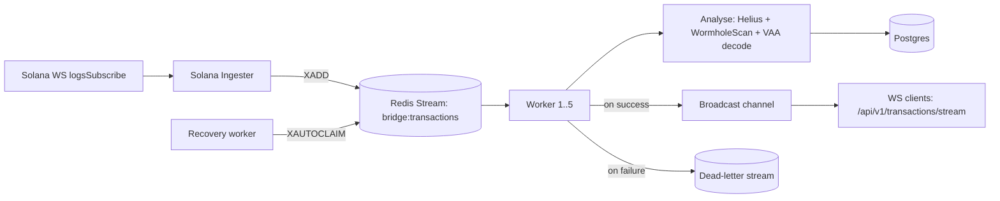
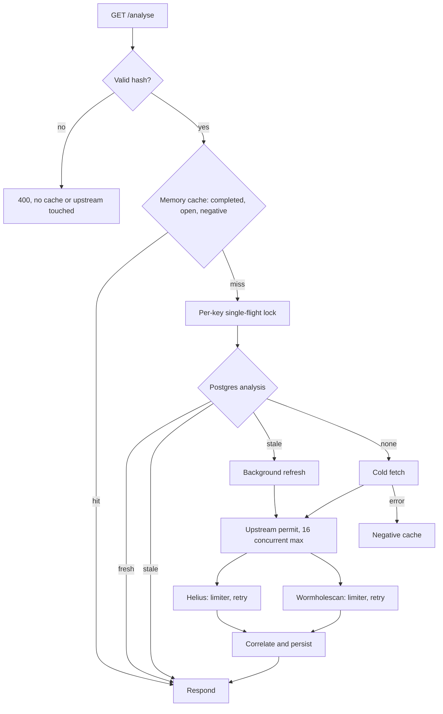

# bridgeIndexer

A real-time indexer for Wormhole cross-chain bridge transfers — watches
each chain's Token Bridge contract, correlates every transfer against its
destination-chain completion, persists it, and streams it live to clients
over WebSocket. Currently indexes Solana, with additional chains landing
incrementally.

## Architecture


```mermaid
flowchart LR
    SOL[Solana WS logsSubscribe] --> ING[Solana Ingester]
    ING -->|XADD| STREAM[(Redis Stream: bridge:transactions)]
    STREAM --> W1[Worker 1..5]
    W1 --> ANALYSE[Analyse: Helius + WormholeScan + VAA decode]
    ANALYSE --> DB[(Postgres)]
    W1 -->|on success| BCAST[Broadcast channel]
    BCAST --> WS[WS clients: /api/v1/transactions/stream]
    W1 -->|on failure| DLQ[(Dead-letter stream)]
    RECOVERY[Recovery worker] -->|XAUTOCLAIM| STREAM
```

Every successfully analysed transaction is persisted to Postgres and, in the
same step, broadcast to any connected WebSocket clients — so the live feed and
the durable record come from a single source of truth, not two separate paths
that can drift.

### Why Redis Streams, not Kafka

Consumer groups plus `XAUTOCLAIM` give exactly the guarantees this needs —
at-least-once delivery, per-worker ack tracking, automatic redelivery of
stuck messages — without a second infrastructure dependency to operate.
Kafka would be the right call at higher throughput or with multiple
independent consumer applications; for a single-service pipeline at this
scale it's added operational cost for guarantees Redis Streams already
provides.

## Read path: `GET /api/v1/transactions/analyse`

A cold analysis is expensive: Helius and Wormholescan are called in parallel,
the VAA is decoded, and the transfer is correlated with its destination chain
(about 360 ms median, and both providers rate-limit). The read path exists so
that almost no request pays that cost.


```mermaid
flowchart TD
    REQ[GET /analyse] --> VAL{Valid hash?}
    VAL -- no --> E400[400, no cache or upstream touched]
    VAL -- yes --> MEM{"Memory cache: completed, open, negative"}
    MEM -- hit --> RESP[Respond]
    MEM -- miss --> LOCK[Per-key single-flight lock]
    LOCK --> DB{Postgres analysis}
    DB -- fresh --> RESP
    DB -- stale --> RESP
    DB -- stale --> BG[Background refresh]
    DB -- none --> COLD[Cold fetch]
    COLD --> PERM[Upstream permit, 16 concurrent max]
    PERM --> HEL[Helius: limiter, retry]
    PERM --> WH[Wormholescan: limiter, retry]
    HEL --> CORR[Correlate and persist]
    WH --> CORR
    CORR --> RESP
    COLD -- error --> NEG[Negative cache]
    BG --> PERM
```

| Layer | What it does |
| --- | --- |
| Hash validation | Rejects anything that isn't a 64-byte base58 Solana signature before any cache or upstream call. |
| Memory cache (moka) | `completed` transfers for 10 min, `open` (Pending/Detected) for 15 s, `not_found` for 30 s, transient upstream failures for 2 s. |
| Single-flight lock | One request per transaction hash does the work; concurrent requests for the same hash wait, then re-check memory. 50 concurrent requests for one uncached hash cause 1 upstream fetch. |
| Postgres | `bridge_transfers.analysis` holds the last analysis. Completed transfers are always fresh; Pending/Detected ones are fresh for 60 s. |
| Stale-while-revalidate | A stale row is served immediately and refreshed in the background (max 8 refreshes at once, 15 s cooldown per key). A failed refresh only logs; the stale copy keeps being served. |
| Rate limiting | One limiter per provider (`governor`), so retries can't exceed a provider's quota. A call waits at most 2 s for a token, then fails fast with a 503. |
| Retries | 429, timeout and 502 retry up to 3 times with exponential backoff and jitter, each attempt going back through the limiter. |
| Concurrency cap | A semaphore bounds concurrent cold fetches (16); waiting for a permit times out after 2 s with a 503. |

Steady-state upstream load is roughly `hot keys ÷ freshness window`. With the
60 s window, 769 hot Pending transfers need about 13 refreshes per second,
which has to stay under the configured provider quotas.

### Tuning

| Setting | Where | Default |
| --- | --- | --- |
| Freshness window for non-Completed rows | `FRESH_SECS` in `services/read_through.rs` | 60 s |
| Max background refreshes | `MAX_BACKGROUND_REFRESHES` in `services/read_through.rs` | 8 |
| Cache TTLs and capacities | `ReadThrough::new` | see table above |
| Provider quotas | `AppState::new` (`helius_limiter`, `wormhole_limiter`) | 40/s and 20/s, set these just under your plan limits |

## Reliability properties

* **At-least-once processing, exactly-once persistence.** Redis Streams
  guarantees at-least-once delivery; Postgres upserts on `hash` and
  `(emitter_chain, emitter_address, sequence)` absorb redelivery, so a crash
  mid-batch can never double-write.
* **Dead-letter queue.** Transactions that fail analysis or persistence after
  retries move to `bridge:transactions:failed` instead of blocking the stream
  or being silently dropped.
* **Self-healing recovery.** A dedicated worker reclaims messages abandoned by
  a crashed consumer via `XAUTOCLAIM` every 30s.
* **Graceful shutdown.** SIGTERM/Ctrl+C stops new work being picked up, lets
  in-flight messages finish, and drains open HTTP/WS connections before exit.
* **RPC rate-limit resilience.** Destination-chain lookups (`chain_adapters::evm`)
  page through `eth_getLogs` in provider-configurable block-size chunks rather
  than one unbounded query — the default is 2000 blocks, but any chain can be
  constructed with a tighter cap via `EvmAdapter::with_block_range(...)` for
  RPC providers on rate-limited tiers (e.g. Base on a free-tier Alchemy key,
  capped at 10 blocks per call). If a provider rejects a range as too wide at
  runtime, the adapter automatically shrinks the window and retries rather
  than failing the transaction outright.
* **Upstream protection on the read path.** Per-provider rate limiters, retries
  with backoff and jitter, a bounded concurrency semaphore, and fail-fast 503s
  with `Retry-After` keep a burst of new transactions from turning into a
  provider ban or an unbounded queue.
* **Failures are cached too.** Not-found results (30 s) and transient upstream
  failures (2 s) are remembered, so one bad hash can't make every request redo
  the full upstream attempt or pile up behind its lock.
* **Stale data beats a slow answer.** Pending transfers past their freshness
  window are served from Postgres while a background task refreshes them
  through the same limiters.

## API

```
GET /api/v1/transactions/analyse?transaction_hash=<hash>&chain=solana
WS  /api/v1/transactions/stream
```

`chain` is the source chain. Solana is currently the only supported source
chain; anything else returns `422 NORMALISATION_FAILED`.

| Status | Code | Meaning |
| --- | --- | --- |
| 200 | | Analysis returned (from cache, Postgres, or a fresh fetch). |
| 400 | `INVALID_TX_HASH`, `BAD_REQUEST` | Malformed hash or request. |
| 404 | `TX_NOT_FOUND`, `VAA_NOT_AVAILABLE` | Transaction doesn't exist, or its VAA isn't available yet. Cached briefly. |
| 422 | `NORMALISATION_FAILED` | Transaction data couldn't be normalised, including unsupported chains. |
| 429 | `UPSTREAM_RATE_LIMITED` | A provider rate-limited the request after retries. Sends `Retry-After: 1`. |
| 502 / 504 | `UPSTREAM_ERROR`, `UPSTREAM_TIMEOUT` | A provider failed or timed out after retries. |
| 503 | `OVERLOADED` | The service is shedding load (limiter or permit wait exceeded 2 s). Sends `Retry-After: 1`. |
| 500 | `INTERNAL_ERROR` | Unexpected error. |

CORS is origin-allowlisted via `ALLOWED_ORIGINS` — nothing is permitted by
default.

## Performance

Measured with [`oha`](https://github.com/hatoo/oha) from a separate EC2
instance in the same VPC (two instances, 30-second runs, 50 connections,
769 distinct Solana transactions, 1.2 KiB responses, warm cache).

<!-- TODO: add instance types -->

| Workload | Result |
| --- | --- |
| Cache hits | 36.5k and 37.1k req/s over two runs, 1.1M requests each, every response a 200 |
| Median latency | about 0.8 ms (p99 about 33 ms) |
| 200 connections | 33.9k req/s, load generator CPU at 100% |
| Cold burst, 50 concurrent requests for one hash | 1 upstream fetch, all 50 served in a 28 ms window |
| Junk hashes | about 55k req/s of cheap 400s, zero upstream calls |

What these numbers do and don't mean:

* They are cache-hit throughput, and a lower bound: at 200 connections the
  load generator was CPU-bound, so the server's own ceiling hasn't been measured.
* Uncached transactions are limited by the providers. With the default quotas
  (40/s Helius, 20/s Wormholescan) that is roughly 20 new lookups per second;
  overflow gets a 503 after 2 s.
* There is a cluster of 33–45 ms requests that hasn't been explained yet.
* The cache lives in one process, so several instances would each refresh
  their own copies.

### Reproducing

Build a file with one URL per line (valid Solana signatures only, since
`oha`'s "success rate" counts any HTTP response, so always read the status
code distribution):

```bash
oha -z 30s -c 50 --urls-from-file urls.txt
```

Run it twice. The first run fills the cache and the second is the warm number.

## Running locally

Requires Postgres and Redis reachable at the URLs below.

```bash
cp .env.example .env   # fill in RPC URLs, bridge contract addresses, etc.
sqlx migrate run
cargo run
```

## Testing

```bash
cargo test
```

`tests/persistence_idempotency.rs` spins up a real Postgres container
(via `testcontainers`) and asserts that redelivering the same transaction —
the scenario `XAUTOCLAIM` recovery guarantees will happen — never produces a
duplicate row.

## Roadmap: multi-chain ingestion

Ingestion currently watches Solana only — transfers are correctly attributed
to their real source/destination chain in either direction (Solana → X or
X → Solana), but a transfer that never touches Solana isn't observed yet.

The correlation layer (`services::correlator`) and the destination-lookup
adapters (`chain_adapters::evm`, `chain_adapters::wormholescan`) are already
chain-agnostic and already wired up in `AdapterRegistry` for Ethereum, BSC,
Polygon, Avalanche, Arbitrum, Optimism, Gnosis, and Base — specifically so
adding a chain doesn't require touching correlation logic. What's missing per
chain is the ingestion side: a chain-specific listener that watches its Token
Bridge contract and pushes candidates onto the same `bridge:transactions`
Redis stream Solana's ingester already writes to.

Planned rollout, one chain at a time:

* \[x] Solana
* \[ ] Ethereum
* \[ ] BSC
* \[ ] additional EVM chains, as the pattern proves out

Each addition is a new `ingestion::<chain>` module plus a normaliser for that
chain's transaction shape — the Redis pipeline, correlator, persistence, and
WebSocket fanout all stay untouched.
